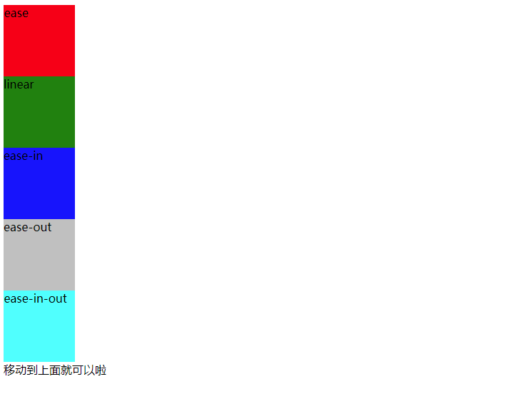

## Transition属性：


| 属性 | 描述 | CSS |
| ------ | ------ | ------ |
| [transition](http://www.w3school.com.cn/cssref/pr_transition.asp) | 简写属性，用于在一个属性中设置四个过渡属性。 | 3 |
| [transition-property](http://www.w3school.com.cn/cssref/pr_transition-property.asp) | 规定应用过渡的 CSS 属性的名称。 | 3 |
| [transition-duration](http://www.w3school.com.cn/cssref/pr_transition-duration.asp) | 定义过渡效果花费的时间。默认是 0。 | 3 |
| [transition-timing-function](http://www.w3school.com.cn/cssref/pr_transition-timing-function.asp) | 规定过渡效果的时间曲线。默认是 "ease"。 | 3 |
| [transition-delay](http://www.w3school.com.cn/cssref/pr_transition-delay.asp)| 规定过渡效果何时开始。默认是 0 | 3 |


额外提一下两个属性：

* transition-property   
 all: 所有属性， none: 也就是不生效。  
 当然也不是所有的属性都可以来动效， 具体的参考[Certain CSS properties can be animated ](https://developer.mozilla.org/en-US/docs/Web/CSS/CSS_animated_properties)  
 不支持的动画属性：background-image,  float,  display,  position,  visibility
* transition-timing-function   
  三阶贝塞尔曲线函数， 这里只要两个控制点的值。   
  内置了几个简单的，更多的可以在这里获得[在线贝塞尔](http://yisibl.github.io/cubic-bezier/)

    1、ease：逐渐变慢, 贝塞尔曲线(0.25, 0.1, 0.25, 1.0)   
    2、linear：匀速，linear 贝塞尔曲线(0.0, 0.0, 1.0, 1.0)   
    3、ease-in：加速，ease-in 贝塞尔曲线(0.42, 0, 1.0, 1.0)   
    4、ease-out：减速，ease-out贝塞尔曲线(0, 0, 0.58, 1.0)   
    5、ease-in-out：加速然后减，ease-in-out 贝塞尔曲线(0.42, 0, 0.58, 1.0)   

  这里的取值还有一种steps函数，可以参考[深入理解CSS过渡transition](https://www.cnblogs.com/xiaohuochai/p/5347930.html)  

##  Transition事件
* [transitioncancel](https://developer.mozilla.org/en-US/docs/Web/API/HTMLElement/transitioncancel_event)  
  转换取消事件 ， 该事件和transitionend互斥，只会有一个发生。
* [transitionend](https://developer.mozilla.org/en-US/docs/Web/API/HTMLElement/transitionend_event)   
  转换结束事件
* [transitionrun](https://developer.mozilla.org/en-US/docs/Web/API/HTMLElement/transitionrun_event)  
  转换进行事件  
* [transitionstart](https://developer.mozilla.org/en-US/docs/Web/API/HTMLElement/transitionstart_event)   
  转换开始事件，**因为转换有delay属性，所以进行，不一定真正的开始。**

```js
const transition = document.querySelector('.transition');

transition.addEventListener('transitioncancel', () => {
  console.log('Transition canceled');
});
```

## 简单的Demo

### 内置贝塞尔函数运动效果
[贝塞尔曲线运动](../css/transition/timing-fun.html)    


### 雪花飘飘
[雪花](../css/transition/snow.html)    


### 类似外卖的添加到购物车  
因为transition只能定义开始和结束，不能定义中间态，所以没有抛物曲线效果。   
个人还有以下思路：   
1. 多段transition
2. 贝塞尔曲线
3. animation， 也许也有难度   
[购物车添加](../css/transition/prod.html)   


> [CSS Transitions](https://www.w3.org/TR/css-transitions-1/)   
[Using CSS transitions](https://developer.mozilla.org/en-US/docs/Web/CSS/CSS_Transitions/Using_CSS_transitions)    
[TransitionEventSection](https://developer.mozilla.org/en-US/docs/Web/API/TransitionEvent)  
[css-transitions | Can I Use](https://caniuse.com/#feat=css-transitions)   
[深入理解CSS过渡transition](https://www.cnblogs.com/xiaohuochai/p/5347930.html)  